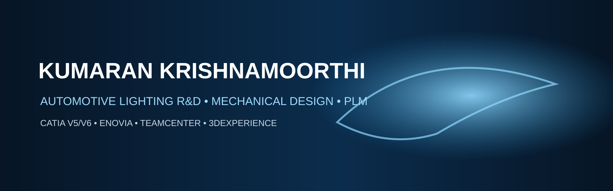

# KUMARAN KRISHNAMOORTHI

### Senior Mechanical Design Engineer
**Automotive Lighting R&D • Mechanical Design • Vehicle Integration • PLM**

**6+ Years • Bengaluru, India**

[LinkedIn](https://www.linkedin.com/in/kumaran-k-431119157) • [GitHub](https://github.com/sivakumarank28-cell) • [Engineering Portfolio](./portfolio/README.md)

---

## 👋 About Me

I am a **Senior Mechanical Design Engineer** focused on **automotive lighting product development**, with experience spanning **headlamp, rear-lamp and interior-lighting systems**.

My work combines **3D CAD design, packaging, mounting strategy, vehicle integration, DFM, tooling feasibility, validation and supplier coordination** with engineering data and PLM workflows.

**Primary tools:** CATIA V5/V6 • ENOVIA • Teamcenter • 3DEXPERIENCE

---

## ⚙️ Engineering Capability

<table>
<tr>
<td width="25%" align="center"><b>LIGHTING</b> Headlamp Rear Lamp Interior Lighting</td>
<td width="25%" align="center"><b>MECHANICAL</b> Plastic Components Packaging DFM / Draft</td>
<td width="25%" align="center"><b>INTEGRATION</b> Mounting Strategy RRSH Installation / Fitment</td>
<td width="25%" align="center"><b>PLM</b> ENOVIA Teamcenter 3DEXPERIENCE</td>
</tr>
</table>

---

## 🚗 Program / OEM Exposure

| Program / OEM | Engineering focus |
|---|---|
| **Nissan Micra EV** | Automotive lighting development |
| **Renault Duster** | Lighting / vehicle integration |
| **Nissan Premium Hatchback** | Lighting development |
| **Mercedes-Benz** | Headlamp RFQ / feasibility |
| **Audi** | Lighting development |
| **BMW** | Lighting development |
| **Opel** | Lighting development |

> Project information is intentionally presented at a professional, non-confidential level.

---

## 🧰 Core Technical Stack

**CAD & Design**  
CATIA V5 • CATIA V6 • Plastic Component Design • 3D CAD • 2D Drawings

**Automotive Lighting**  
Headlamp • Rear Lamp • Interior Lighting • Lamp Definition • Packaging • Mounting Strategy

**Integration & Manufacturing**  
Vehicle Integration • Installation Checks • RRSH • Homogeneity Reviews • DFM • Draft Analysis • Tooling Feasibility • Validation

**PLM & Digital Engineering**  
ENOVIA • ENOVIA Target2 • Teamcenter • 3DEXPERIENCE • Engineering Data / Lifecycle Concepts

---

## 📂 Featured Engineering Portfolio

### 💡 [Nissan Micra EV — Lighting Case Study](./projects/nissan-micra-ev/README.md)
Headlamp/rear-lamp development, packaging, mounting strategy, isostatism, RRSH and vehicle-integration topics.

### 🔧 [Automotive Lighting — Design & Integration](./projects/automotive-lighting/README.md)
A structured reference covering mechanical design, packaging, DFM, tooling feasibility and integration.

### 🗂️ [ENOVIA / 3DEXPERIENCE Learning](./learning/enovia-3dexperience/README.md)
PLM fundamentals, lifecycle concepts, workflows, REST API fundamentals and digital-engineering exploration.

### 🧭 [Complete Portfolio Map](./portfolio/README.md)
The central index for engineering case studies and learning projects.

---

## 🔄 Engineering Workflow

**UNDERSTAND** → **DESIGN** → **PACKAGE** → **INTEGRATE** → **VALIDATE** → **RELEASE**

---

## 🎯 Current Professional Focus

- Automotive lighting mechanical design & development
- Headlamp / rear-lamp / interior-lighting systems
- Vehicle integration and packaging
- Plastic component design and DFM
- ENOVIA / 3DEXPERIENCE / PLM
- Digital engineering and AI-assisted PLM workflows

---

## 📊 GitHub Activity

---

## 📫 Connect

**LinkedIn:** [linkedin.com/in/kumaran-k-431119157](https://www.linkedin.com/in/kumaran-k-431119157)  
**GitHub:** [github.com/sivakumarank28-cell](https://github.com/sivakumarank28-cell)

### Engineering principle

> **Design for function. Validate for integration. Release for manufacturing.**

**Automotive Lighting • Mechanical Design • PLM • Digital Engineering**

